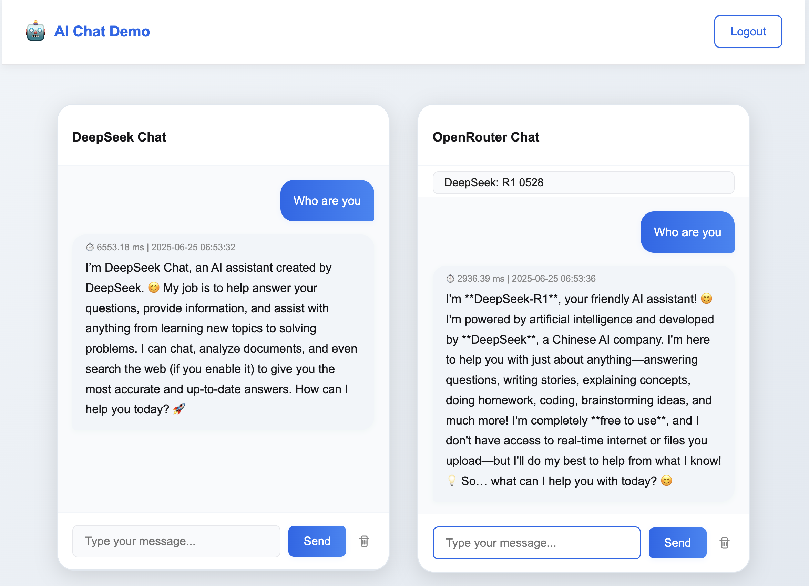

# DeepSeek vs OpenRouter Chat Comparison

A web application that allows users to compare responses from DeepSeek and OpenRouter AI models side by side in a dual chat interface.

## Preview



<video src="screens/preview.mp4" controls="controls" style="max-width: 730px;">
</video>

## Features

- **Dual Chat Interface**: Compare responses from DeepSeek and OpenRouter models simultaneously
- **Model Selection**: Choose from various AI models available through OpenRouter
- **Secure Authentication**: Simple passcode-based login system
- **Responsive Design**: Works on desktop and mobile devices
- **Real-time Response Metrics**: View response times and timestamps for each message

## Project Structure

```
├── api/                  # Backend API endpoints
│   ├── config.sample.php # Configuration template (copy to config.php)
│   ├── login.php         # Login handler
│   ├── logout.php        # Logout handler
│   ├── openrouter_models.php # Fetches available models from OpenRouter
│   └── send_message.php  # Handles sending messages to AI providers
├── assets/               # Frontend assets
│   ├── app.js            # JavaScript functionality
│   └── style.css         # CSS styles
├── includes/             # PHP includes
│   ├── functions.php     # Helper functions
│   └── session.php       # Session management
├── screens/              # Preview media
│   ├── preview.mp4       # Demo video
│   └── preview.png       # Screenshot
├── .gitignore            # Git ignore file
├── .htaccess             # Apache configuration
├── home.php              # Main chat interface
├── index.php             # Login page
├── LICENSE               # License file
└── README.md             # This file
```

## Setup Instructions

1. Clone the repository:
   ```
   git clone https://github.com/yourusername/deepseek-openrouter-comparison-chat.git
   cd deepseek-openrouter-comparison-chat
   ```

2. Create a configuration file:
   ```
   cp api/config.sample.php api/config.php
   ```

3. Edit `api/config.php` and add your API keys:
   - Get a DeepSeek API key from [DeepSeek](https://platform.deepseek.com/)
   - Get an OpenRouter API key from [OpenRouter](https://openrouter.ai/)
   - Set a secure login passcode

4. Deploy to a PHP-enabled web server (e.g., Apache, Nginx)

5. Access the application through your web browser

## API Keys

This application requires API keys from:

- **DeepSeek**: Used for the DeepSeek chat functionality
- **OpenRouter**: Used to access various AI models including Claude, GPT-4, Llama, etc.

## Security Notes

- The application uses CSRF tokens to prevent cross-site request forgery
- API keys are stored in a configuration file that should be kept secure
- Simple passcode authentication is implemented (can be enhanced for production)

## Browser Compatibility

- Chrome (latest)
- Firefox (latest)
- Safari (latest)
- Edge (latest)

## License

This project is licensed under the MIT License - see the LICENSE file for details.

## Troubleshooting

- If you encounter CSRF token errors, ensure your session is properly configured
- For model selection issues in OpenRouter, check the browser console for debugging information
- Make sure your API keys are valid and have sufficient credits
